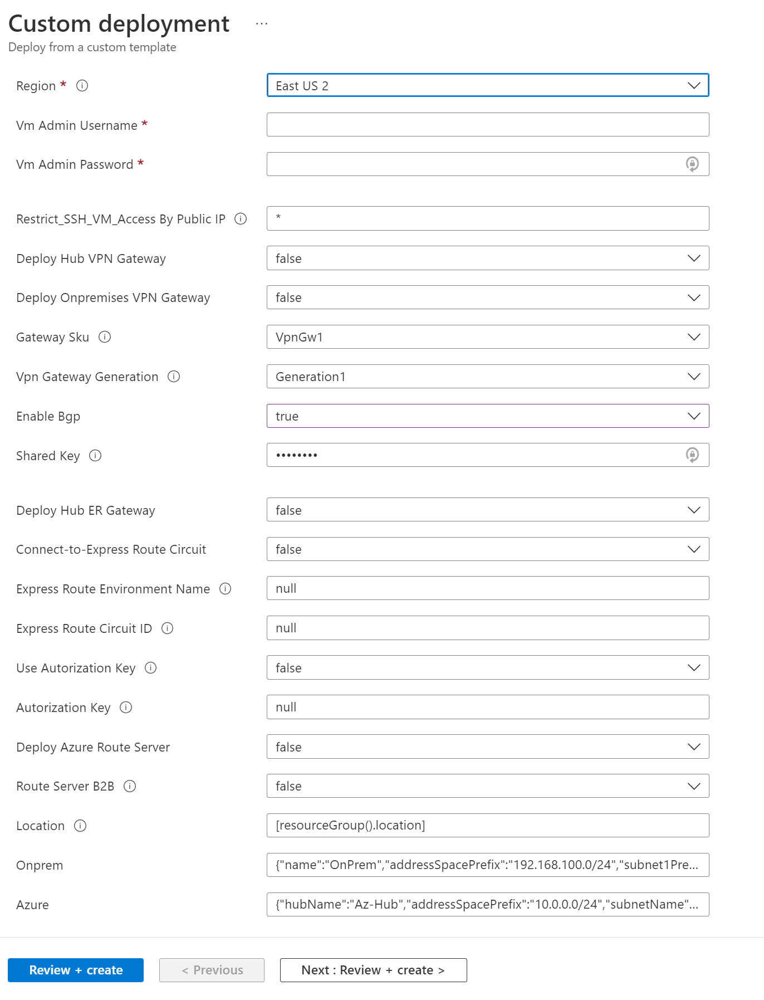

# Azure Hub and Spoke base Lab

## Introduction

This is a base ARM template script that deploys a Hub/Spoke and some other networking components such as Virtual Network Gateway ExpressRoute and VPN.

## Components

- Azure VMs (Hub, Spokes and Branches)
- Azure Hub and two spokes
- On-premises with S2S VPN connected to Azure Hub A/A VPN Gateway.
- Route Server with B2B control
- Azure ExpressRoute Gateway

## Deploy over Portal

[](https://portal.azure.com/#create/Microsoft.Template/uri/https%3A%2F%2Fraw.githubusercontent.com%2Fdmauser%2Fazure-hub-spoke-base-lab%2Fmain%2Fazuredeploy.json)

Here is a screenshot example with the parameters and options to select before provisioning:



## Deploy over CLI

Here is an example for deploy this template over CLI with parameters:

```bash
## CLI deploy example deploying using a different VNET address space (Azure and On-premises)
#Variables
rg=lab-azure-lab #Define your resource group
VMAdminUsername=dmauser #specify your user
location=centralus #Set Region
mypip=$(curl ifconfig.io -s) #captures your local Public IP and adds it to NSG to restrict access to SSH only for your Public IP.
sharedkey=$(openssl rand -base64 24) #VPN Gateways S2S shared key is automatically generated.
ERenvironmentName=AVS-CUS #Set remove environment connecting via Expressroute (Example: AVS, Skytap, HLI, OnPremDC)
ERResourceID="/subscriptions/SubID/resourceGroups/RG/providers/Microsoft.Network/expressRouteCircuits/ERCircuitName" ## ResourceID of your ExpressRoute Circuit.
UseAutorizationKey="No" #Use authorization Key, possible values Yes or No.
AutorizationKey="null" #Only add ER Authorization Key if UseAutorizationKey=Yes.

#Define emulated On-premises parameters:
OnPremName=OnPrem #On-premises Name
OnPremVnetAddressSpace=192.168.10.0/24 #On-premises VNET address space
OnPremSubnet1prefix=192.168.10.0/25 #On-premises Subnet1 address prefix
OnPremgatewaySubnetPrefix=192.168.10.128/27 #On-premises Gateways address prefix
OnPremgatewayASN=60010 #On-premises VPN Gateways ASN

#Define parameters for Azure Hub and Spokes:
AzurehubName=Az-Hub #Azure Hub Name
AzurehubaddressSpacePrefix=10.0.10.0/24 #Azure Hub VNET address space
AzurehubNamesubnetName=subnet1 #Azure Hub Subnet name where VM will be provisioned
Azurehubsubnet1Prefix=10.0.10.0/27 #Azure Hub Subnet address prefix
AzurehubgatewaySubnetPrefix=10.0.10.32/27 #Azure Hub Gateway Subnet address prefix
AzureFirewallPrefix=10.0.10.64/26 #Azure Firewall Prefix
AzurehubrssubnetPrefix=10.0.10.128/27 #Azure Hub Route Server subnet address prefix
Azurespoke1Name=Az-Spk1 #Azure Spoke 1 name
Azurespoke1AddressSpacePrefix=10.0.11.0/24 # Azure Spoke 1 VNET address space
Azurespoke1Subnet1Prefix=10.0.11.0/27 # Azure Spoke 1 Subnet1 address prefix
Azurespoke2Name=Az-Spk2 #Azure Spoke 1 name
Azurespoke2AddressSpacePrefix=10.0.12.0/24 # Azure Spoke 1 VNET address space
Azurespoke2Subnet1Prefix=10.0.12.0/27 # Azure Spoke 1 VNET address space

#Parsing parameters above in Json format (do not change)
JsonAzure={\"hubName\":\"$AzurehubName\",\"addressSpacePrefix\":\"$AzurehubaddressSpacePrefix\",\"subnetName\":\"$AzurehubNamesubnetName\",\"subnet1Prefix\":\"$Azurehubsubnet1Prefix\",\"AzureFirewallPrefix\":\"$AzureFirewallPrefix\",\"gatewaySubnetPrefix\":\"$AzurehubgatewaySubnetPrefix\",\"rssubnetPrefix\":\"$AzurehubrssubnetPrefix\",\"spoke1Name\":\"$Azurespoke1Name\",\"spoke1AddressSpacePrefix\":\"$Azurespoke1AddressSpacePrefix\",\"spoke1Subnet1Prefix\":\"$Azurespoke1Subnet1Prefix\",\"spoke2Name\":\"$Azurespoke2Name\",\"spoke2AddressSpacePrefix\":\"$Azurespoke2AddressSpacePrefix\",\"spoke2Subnet1Prefix\":\"$Azurespoke2Subnet1Prefix\"}
JsonOnPrem={\"name\":\"$OnPremName\",\"addressSpacePrefix\":\"$OnPremVnetAddressSpace\",\"subnet1Prefix\":\"$OnPremSubnet1prefix\",\"gatewaySubnetPrefix\":\"$OnPremgatewaySubnetPrefix\",\"asn\":\"$OnPremgatewayASN\"}

az group create --name $rg --location $location
az deployment group create --name RSERVPNTransitLab-$location --resource-group $rg \
--template-uri https://raw.githubusercontent.com/dmauser/Lab/master/RS-ER-VPN-Gateway-Transit/azuredeploy.json \
--parameters VmAdminUsername=$VMAdminUsername gatewaySku=VpnGw1 vpnGatewayGeneration=Generation1 sharedKey=$sharedkey ExpressRouteEnvironmentName=$ERenvironmentName expressRouteCircuitID=$ERResourceID UseAutorizationKey=$UseAutorizationKey UseAutorizationKey=$UseAutorizationKey Onprem=$JsonOnPrem Azure=$JsonAzure \
--no-wait
```